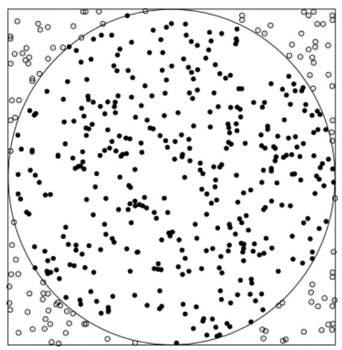

# Calculating Pi

## Introduction
The main goal is to calculate the number, Pi, with up to a desired precision.
There are quite a lot of ways to do that, some ways better than others. Here is a list of a few one of them I could find:

### Algorithms:

* Monte Carlo: Monte Carlo methods, are a broad class of algorithms used to calculate certain amounts, using random sampling.
  One of the first problems that was solved by this method was the Buffon's needle problem, in which π can be estimated by dropping needles on a floor randomly.

Another way of calculating Pi with this method is like this: Imagine there is a square, with 2r as its width. And a circle bound inside it. we can calculate Pi using this formula:

The Problem with This Method: The computational cost of this method can be really high. This is not an optimal method for calculating Pi with 1000 floating points.

* Gregory-Leibniz Series:
  
  This is a really simple method for calculating Pi. The way to implement this is to create a class that either extends the Thread class, or implements the Runnable interface. Then we can assign one or more fields of this series to be calculated by each instance.

The Problem with This Method: It converges extremely slowly. Calculating π to 10 correct decimal places using direct summation of the series requires precisely five billion terms. So, this is not an optimal way for calculating Pi either.

* BBP Formula: The Bailey–Borwein–Plouffe formula (BBP formula) is a formula for π.
  Brief History:
  It was discovered in 1995. It was wildly believed that computing the nth digit of Pi would be as difficult as calculating the first n digits; but the existence of this formula proved that to be wrong. It is worth to note that even though we can calculate any given digit of Pi with less computational effort than other formulas, it still will take increasingly more time to calculate further digits.
  
  The order of this algorithm is:
  O(nlog(n))

How I implemented this method:
Implementing the FieldCalculator class. This class implements the Runnable interface. The goal is to assign each field to a thread so that it would take less time to calculate Pi.
So, each instance of Field Calculator gets an integer n, which is the number of the field in the series. I used BigDecimal for the calculations, as to be able to store more than a thousand decimal points. The match context I used is set to 1001 precision, so that the program could calculate Pi correctly up to 1000 digits.
The management of the threads is done using a CashedThreadPool. After each instance of Field Calculator does the job, it will add the calculated amount to sum. To ensure that the program avoid race condition, the method that adds the amount to sum is a synchronized method.
In the end, to return the calculated amount with desired number of floating points, I use substring method to get 2 ("3.") plus the required floatingPoint.

* Bellard's Formula: This formula is said to be 43% faster than BBP formula.
  

# Semaphore

## Introduction
	The main goal of this exercise was to get a better understanding the concept of Semaphore in multi-threading. 
## Description
A Semaphore is used to manage a resource that is going to be accessed by multiple users. It can manage the access by letting a few numbers of threads to run, and holding others till one the running threads finishes processing. This is not the same as locking a resource, as there could only be one user/thread that could access that resource at a given time. A semaphore can let multiple threads to access the resource at once.

Here's an example: There is this parking lot that has capacity for 10 cars only. As long as there is at least one parking lot that is not occupied, the manager of that parking lot can let cars in. The moment that the parking is full and there is no empty space, no other can enter. Those cars should wait until one of already parked cars leaves the parking lot.

## Use Cases

Resource Pool: In a multi-client application, a system might want to let a limited number of clients to access a shared resource at the same time, due to the limitations of the system or being able to manage the requests easier.

Signaling among Threads: With a semaphore, we are able to signal a thread to wait for other threads to be done, and then start its execution.

Database Access: To ensure that the queries and operations that are done on a database won’t lead to corruption of data, a semaphore can be used to manage the number of clients and operations that are done on a database.

# References

* https://en.wikipedia.org/wiki/Monte_Carlo_algorithm

* https://www.geeksforgeeks.org/estimating-value-pi-using-monte-carlo/

* Copilot (For research only)

